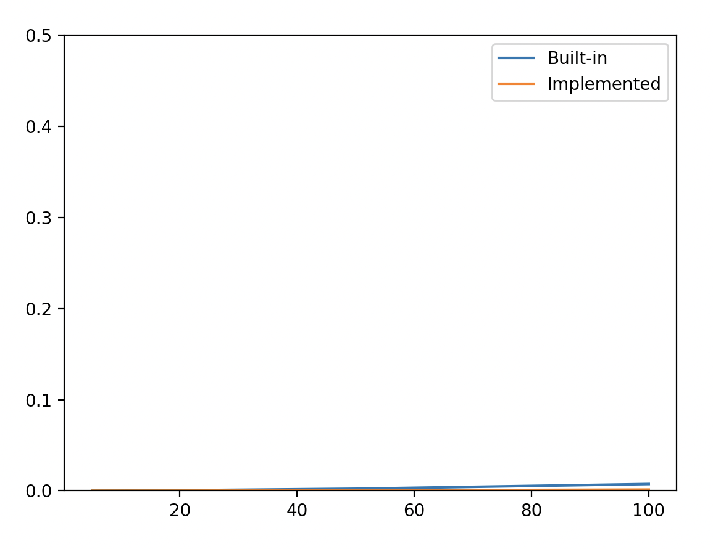
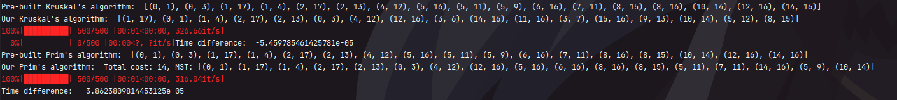
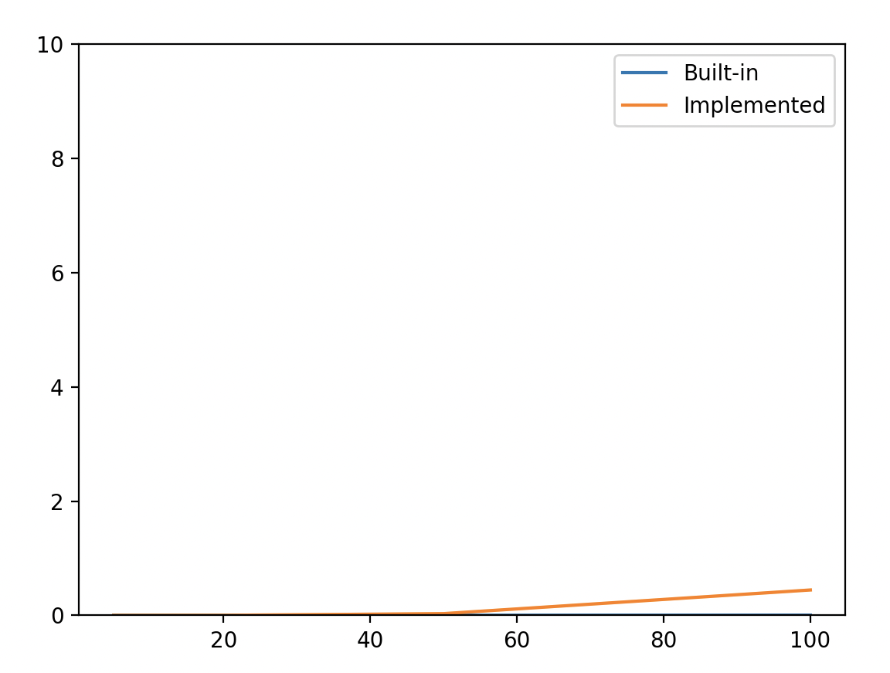
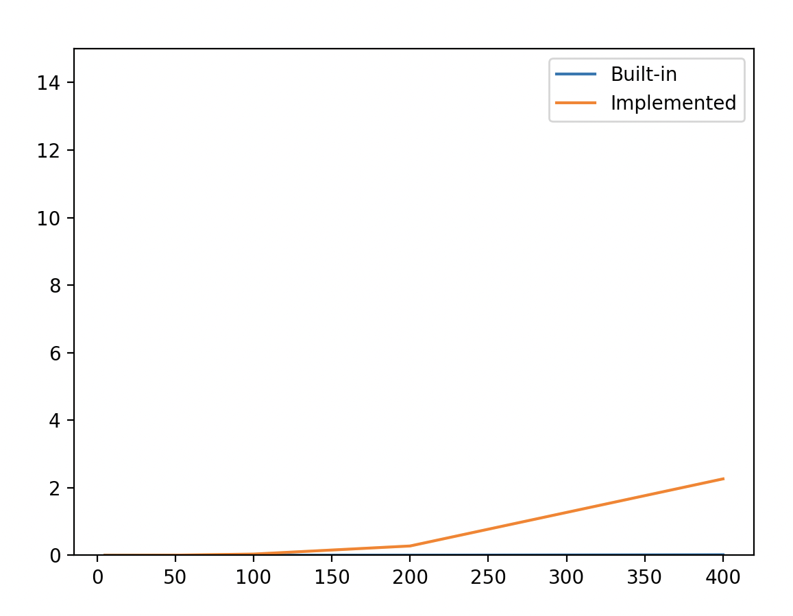
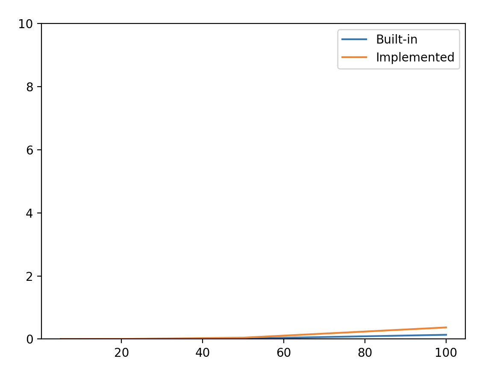
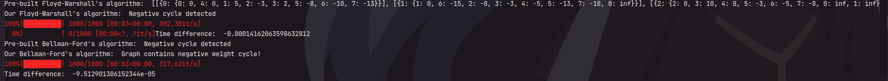

# Graph Magic - How To Turn Your Life Into Nightmare and Back
So, here we demonstrate the result of our hard work dedicated to research on graphs and
algorithms that help us find the least path through the graph itself.

At the very beginning we are given some pre-made code elements and ready algorithms.
Our task was to analyse them and come up with our own alternative ways to make
the similar thing and then compare their effectiveness.

We are dealing with both __ordered__ and __unordered__ graphs, which are __weighted__
(each edge has its own weight). We had to take into consideration the algorithms such
as: _Kruskal's_ algorithm, _Prim's_ algorithm, _Bellman-Ford_ algorithm and
_Floyd-Warshall_ algorithm.

Our hard work was divided into __3__ separate parts. They are:
1. Making own versions of Kruskal and Prim's algorithms and comparing them to
built-in algorithms
2. Making own versions of Bellman-Ford algorithm and
Floyd-Warshall algorithm and comparing them to
built-in algorithms
3. Working with decision trees via our own kitty paws.

Let's take a sneak peak at them.

## Task #1
### [Kruskal's algorithm (Held by: Yevhenii Bevz)](algorythms_a.py)
Kruskal's algorithm sorts edges in ascending order and takes edges one by one. At the same time we keep an eye on set of
used nodes, which helps us to check whether we create a cycle or not. If edge's both nodes are in current set, then we
create a cycle - so, we have to abandon this particular edge and move on.

The algorithm return a list of edges, which make an MST. It may differ from the built-in algorithm, but if you draw a
graph based on final edges - you will get a required MST.
### The graph of time comparison between implemented and built-in algorithm.

### [Prim's algorithm (Held by: Khrystyna Mysak](algorythms_a.py)
Prim’s algorithm was divided into three functions for decomposition and better understanding. 

 1. def cost(graph: object, edge) — gets the weight of the desired edge
 2. def min_prims_edge(graph: object, visited_nodes) — looks for valid incident edges to each node in already visited nodes,
and then compares the weight of those edges to return the minimum edge.
 3. def prim(graph: object) — the main function, which receives a graph object. With the help of min_prims_edge function, 
we get the edge with minimum weight available to us and add it to the MST list. Also, we add the vertices of the minimum
weight to mark them as already visited. The cycle repeats up till we have all the nodes in visited_nodes.
### The graph of time comparison between implemented and built-in algorithm.

### The comparison of Kruskal and Prim algorithms

## Task #2
### [Bellman-Ford's algorithm (Held by: Khrystyna Mysak)](algorythms_b.py)
Bellman-Ford algorithm is an example of dynamic programming, because we constantly change the vertex ‘labels’.
We can divide the code (algorithm) in 3-4 main parts:
 1. Assigning all distances to infinity, except source vertex (starting_node)
 2. Then, we create a loop and iterate through edges of the graph |V| - 1 times. Originally, this is called the relaxation
of all edges in order to find shortest distances from source vertex (starting_node) to all other vertices
 3. (2.) The main goal of the previous step is to reassign distance values and parent index of the adjacent vertices of the picked vertex.
 4. The last step is to check whether our result contains negative cycles (if it does, then the vertex ‘labels’ will change on |V|-th iteration)
 ### The graph of time comparison between implemented and built-in algorithm.
 

### [Floyd-Warshall's algorithm (Held by: Yevhenii Bevz)](algorythms_b.py)
Floyd-Warshall's algorithm is used to determine the shortest path between any two nodes in a graph. For clearance, the
algorithm uses matrix of weights, and each iteration tries paths through every node and replaces each matrix cell, if new
path is shorter than the previous one. Also, the algorythm can detect negative cycle: if there is a negative number in the
main diagonal, then there is a negative cycle in a graph.
### The graph of time comparison between implemented and built-in algorithm.

## Task #3
### Decision tree (Under maintenance)

## Short summary
As we can see, we managed to understand the core idea of the algorithms. Time statistics say that although our implementations are not perfect, they can somehow compete with given algorithms.
The inaccuracy may be caused by lack of programming experience or a bit different way of understanding algorithms. Anyway, the experiments' results clearly state that we were close enough to maintaining good algorithms.
To sum up, we received a valuable experience of programming algorithms and digging deeper in the very understanding of graphs and matrices.

Thanks for attention.
Held by: Eugene Bevz & Khrystyna Mysak